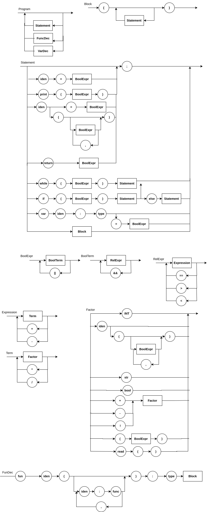

# LogComp25-2

[](https://compiler-tester.insper-comp.com.br/svg/ffiore310/LogComp25-1)

Repositório privado para o desenvolvimento do projeto e dos roteiros relacionados a matéria de Lógica da Computação 

### Diagrama sintático do Projeto


### Gramática EBNF

```ebnf

Program        = { Statement } ;

Statement      = 
      VarDecl ";"
    | Assignment ";"
    | Print ";"
    | IfStatement
    | WhileStatement
    | Block
    | ";" 
    ;

Block          = "{" { Statement } "}" ;

VarDecl        = "let" Identifier ":" Type [ "=" BoolExpression ] ;
Assignment     = Identifier "=" BoolExpression ;

IfStatement    = "if" "(" BoolExpression ")" Statement [ "else" Statement ] ;
WhileStatement = "while" "(" BoolExpression ")" Statement ;

BoolExpression = BoolTerm { "||" BoolTerm } ;
BoolTerm       = RelExpression { "&&" RelExpression } ;
RelExpression  = Expression { ( ">" | "<" | "===" ) Expression } ;
Expression     = Term { ( "+" | "-" ) Term } ;
Term           = Factor { ( "*" | "/" ) Factor } ;

Factor         =
      IntValue
    | BoolValue
    | StringValue
    | Identifier
    | ReadCall
    | "(" BoolExpression ")"
    | ( "+" | "-" | "!" ) Factor
    ;

ReadCall       = "readline" "(" ")" ;

IntValue       = Digit { Digit } ;
StringValue    = '"' { Character } '"' ;
BoolValue      = "true" | "false" ;
Identifier     = Letter { Letter | Digit | "_" } ;
Type           = "number" | "string" | "boolean" ;

Letter         = "A" | ... | "Z" | "a" | ... | "z" ;
Digit          = "0" | "1" | ... | "9" ;
Character      = ? qualquer caractere exceto " e quebra de linha ? ;
```
